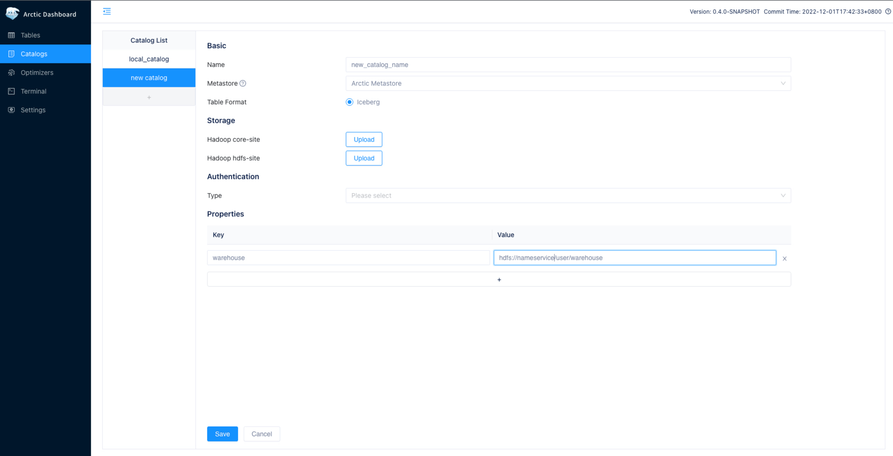

在默认的 AMS 配置中，我们已经初始化了一个名为 `local_catalog` 的基于本地文件系统的集群以方便你的测试。 用户可以通过 AMS Dashboard 提供的 Catalog 管理功能导入更多测试或线上集群。新增 Catalog 前，请阅读以下指引，根据自己的实际需求进行选择创建。

## 创建 Catalog
Arctic 中 catalog 为一组表的命名空间，在 catalog 之下会再分到不同的 database 中，database 下则是不同的 table，catalog.database.table 组成了一张表在 Arctic 中唯一的名称。 在实际应用场景下 catalog 一般对应着一个元数据服务，比如大数据中经常使用的 Hive Metastore， Arctic MetaService 也可以作为一个元数据服务， 另外定义 catalog 时还需要选择它下面所使用的表格式，当前 Arctic 支持的表格式包括：[Iceberg](../concepts/table-formats.md#iceberg-format) 、[Mixed Hive](../concepts/table-formats.md#mixed-hive-format)、[Mixed Iceberg](../concepts/table-formats.md#mixed-iceberg-format)。创建方法如下：

创建 catalog 的详细参数如下：

| **配置项**      | **可用值**                                                   | **描述**                                                     |
| --------------- | ------------------------------------------------------------ | ------------------------------------------------------------ |
| name            | 只支持数字、字母、_、- , 以字母开头（建议字母小写）          | catalog名称                                                  |
| metastore       | Arctic Metastore(代表使用 AMS 存储元数据),Hive Metastore(代表使用 HMS 存储元数据),Hadoop (对应 iceberg 的 Hadoop catalog), Custom(其他 iceberg 的 catalog 实现) | 存放表元数据的存储类型                                       |
| table format    | Iceberg 、Mixed Hive、Mixed  Iceberg                         | 数据存储的表格式，当前只有 metastore 类型 为Hive Metastore 时同时支持 Mixed  Hive/Iceberg 两种，Arctic Metastore 支持 Mixed Iceberg类型。其他 metastore 类型均只支持 Iceberg, 当前一个 Metastore 只支持一种 TableFormat, 未来会支持多种 |
| core-site       | 上传 hadoop 集群的 core-site.xml                             | core-site.xml                                                |
| hdfs-site       | 上传 hadoop 集群的 hdfs-site.xml                             | hdfs-site.xml                                                |
| hive-site       | 上传 Hive 的 hive-site.xml                                   | hive-site.xml                                                |
| auth            | SIMPLE, KERBEROS                                             | 指定 Hadoop 集群的认证方式                                   |
| hadoop_username | Hadoop 用户名                                                | 访问 Hadoop 集群的用户名                                     |
| keytab          | 上传 keytab 文件                                             | KERBEROS 认证方式下所使用的 keytab 文件                      |
| principal       | keytab 对应的 principal                                       | keytab 对应的 principal                                      |
| krb5            | kerberos的 krb5.conf 配置文件                                | kerberos 的 krb5.conf 配置文件                                |
| Properties      | (none)                                                       | 必须配置 **warehouse**; 当 metastore 为 **Custom** 时，需额外定义 **catalog-impl** ,同时用户需要把自定义 catalog 实现的 jar 包放到 **{ARCTIC_HOME}/lib** 目录下，**并且需要重启服务生效**。 |

推荐用户按照下面的指引来创建 Catalog：

- 如果希望和 HMS 协同使用，Metastore 选择 Hive，table format 根据需求选择 [Mixed Hive](../concepts/table-formats.md#Mixed-Hive-format) 或 Iceberg
- 如果希望使用 Arctic 提供的 [Mixed Iceberg format](../concepts/table-formats.md#Mixed-Iceberg-format)，Metastore 选择 Arctic

Catalog 和 Table format 的映射关系如下所示：

| **Catalog Metastore 类型** | **Table format**                       | **备注**                               |
| -------------------------- | -------------------------------------- | -------------------------------------- |
| Arctic Metastore           | Mixed Iceberg                          | Iceberg 兼容表，使用 AMS 存储表的元数据 |
| Hive Metastore             | Mixed Hive                             | Hive 兼容表                            |
| Hive Metastore             | Iceberg                    | 原生 Iceberg 表， 作为 Hive 外表来访问 |                                        |
| Hadoop                     | Iceberg                                | 原生 Iceberg 表                        |
| Custom                     | Iceberg                                | 原生 Iceberg 表                        |

可以在 catalog 详情页对 catalog 的属性进行编辑和保存。

## 删除 Catalog
用户需要删除 Catalog 时，可以进到 Catalog 的详情页，点击页面底端的 Remove 按钮执行删除。

???+ 注意 

    删除 Catalog 前 AMS 会校验是否存储该 Catalog 下表的元数据，如果该 Catalog 下仍存在表的话，会提示删除失败。

